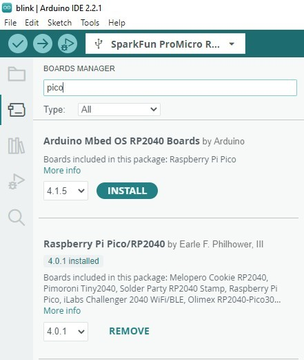

!!! attention
	If this is your first time using Arduino, please read through our tutorial on [installing the Arduino IDE](https://learn.sparkfun.com/tutorials/installing-arduino-ide). If you have not installed an Arduino library before, we recommend you check out our [installation guide](https://learn.sparkfun.com/tutorials/installing-an-arduino-library).

## Arduino-Pico Boards

The SparkFun Pro Micro - RP2350 is supported on the Arduino IDE in the [Arduino-Pico](https://github.com/earlephilhower/arduino-pico) boards package. To install the package, open the Preferences menu by navigating to <b>File</b> > <b>Preferences</b>. Look at the bottom of the Preferences menu for "Additional boards manager URLS" and then copy this JSON link into that field:

<code>
    https://github.com/earlephilhower/arduino-pico/releases/download/global/package_rp2040_index.json
</code>

Click "OK" to close this menu then navigate to the Boards Manager tool and search for "pico" and download the latest release of "Raspberry Pi Pico" (4.0.1 or later).

<figure markdown>
[{ width="400"}](./assets/img/arduino_boards.jpg "Click to enlarge")
</figure>

For more information on using the Arduino-Pico boards package, check out their [documentation page](https://arduino-pico.readthedocs.io/en/latest/index.html).