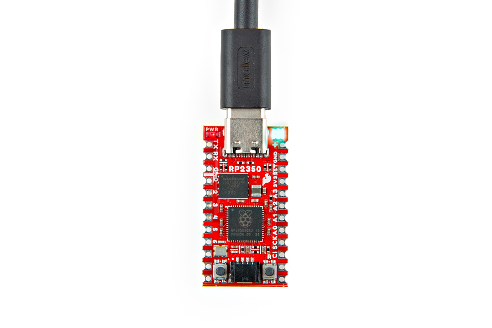

Getting started with the Pro Micro - RP2350 is as easy as plugging it in over USB. The board ships with simple code that cycles the WS2812 RGB LED through a rainbow so on initial power up you should see that cycle.

<figure markdown>
[{ width="400"}](./assets/img/Pro_Micro_USB_Assembly.jpg "Click to enlarge")
</figure>

From here, you can quickly get started programming the board with either the Pico SDK or MicroPython. If you'd like to quickly get started with a variety of I2C devices, SparkFun carries a variety of Qwiic boards with MicroPython support such as the [Optical Tracking Odometry Sensor](https://www.sparkfun.com/products/24904) as shown in the assembly photo below:

<figure markdown>
[{ width="400"}](./assets/img/Pro_Micro_USB_Qwiic_Assembly.jpg)
</figure>

