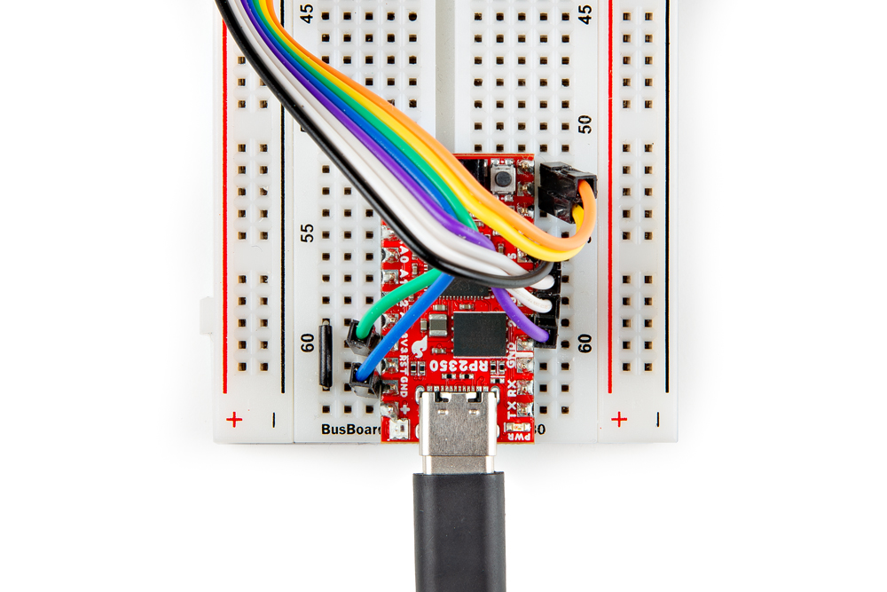

!!! attention "Important!"
    This is an advanced example that assumes users are familiar with using the [Pico SDK](https://www.raspberrypi.com/documentation/pico-sdk/) to build and run projects. If you have not previously used the Pico SDK we strongly encourage going through Raspberry Pi's tutorials on getting started with it before continuing with this example.

If you'd like to follow along with the Arducam PRSAM Demo in this guide, you'll need to connect the Arducam M5 camera module to the Pro Micro over both SPI and I2C as well as connections for input voltage and ground. We recommend soldering male headers to the Pro Micro as the photo below shows and then plugging it into a breadboard for easy prototyping.

<figure markdown>
[{ width="400"}](./assets/img/Pro_Micro_Headers.jpg "Click to enlarge")
</figure>

-   <a href="https://learn.sparkfun.com/tutorials/5">
    <figure markdown>
    
    <figcaption markdown>How to Solder: Through-Hole Soldering</figcaption>
    </figure>
    </a>

??? note "New to soldering?"
	If you have never soldered before or need a quick refresher, check out our [How to Solder: Through-Hole Soldering](https://learn.sparkfun.com/tutorials/how-to-solder-through-hole-soldering) guide.
	

		<a href="https://learn.sparkfun.com/tutorials/5">
		 
        How to Solder: Through-Hole Soldering</a>
	

Next, connect the Arducam wire harness to the camera assembly if you have not already then connect it to the Pro Micro - RP2350 following the assembly table below:

<table>
    <tr>
        <th>Pro Micro - RP2350</th>
        <th>Arducam Camera</th>
    </tr>
    <tr>
        <td>5</td>
        <td>CS</td>
    </tr>
    <tr>
        <td>3</td>
        <td>MOSI/COPI</td>
    </tr>
    <tr>
        <td>4</td>
        <td>MISO/CIPO</td>
    </tr>
    <tr>
        <td>2</td>
        <td>SCK</td>
    </tr>
    <tr>
        <td>8</td>
        <td>SDA</td>
    </tr>
    <tr>
        <td>9</td>
        <td>SCL</td>
    </tr>
    <tr>
        <td>3V3</td>
        <td>VCC</td>
    </tr>
    <tr>
        <td>GND</td>
        <td>GND</td>
    </tr>
</table> 

Finally, you'll want to connect a jumper wire between <b>A3</b> and <b>GND</b>. The code refers to the state of A3/GPIO29 (called 29 in the code) to run the image processing algorithm. The code sets A3/GPIO29 as an input with an internal pull-up resistor enabled. When the pin is pulled LOW through the jumper wire there is no image processing and the image should appear as a normal greyscale. When the jumper is removed, the code enables the processing algorithm to apply image thresholding. 

With the wiring completed, it should look similar to the photo below

<figure markdown>
[{ width="400"}](./assets/img/Pro_Micro_Camera_Wiring.jpg "Click to enlarge")
</figure>