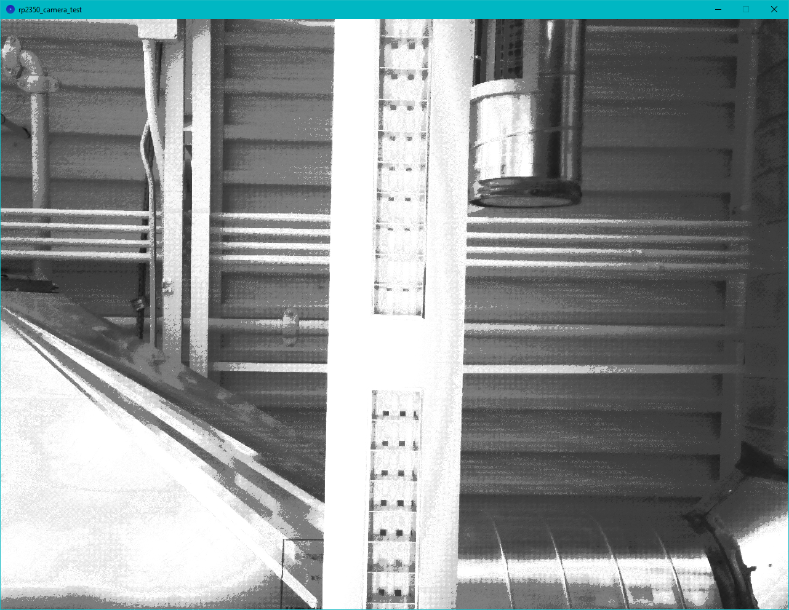
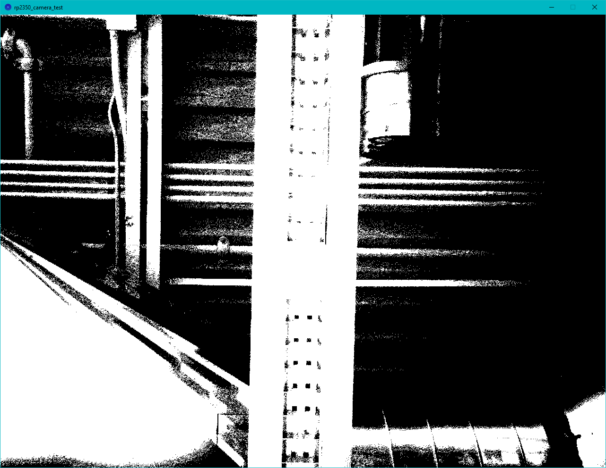

!!! attention "Important!"
    This is an advanced example that assumes users are familiar with using the [Pico SDK](https://www.raspberrypi.com/documentation/pico-sdk/) to build and run projects. If you have not previously used the Pico SDK we strongly encourage going through Raspberry Pi's tutorials on getting started with it before continuing with this example.

The Arducam PSRAM Example is a modified version of [Arducam's Videostreaming example](https://github.com/ArduCAM/PICO_SPI_CAM/tree/master/C/Examples/Arducam_MINI_5MP_Plus_Videostreaming) that uses the Arducam to take still images and send them to the RP2350 and then process and transmit the images over USB to be displayed using a [Processing](https://processing.org/) sketch. The primary goal of this example is to demonstrate how to set up and use PSRAM on the Pro Micro - RP2350 using the Pico SDK and the cool images are a neat bonus!

## Software Requirements

Along with the Pico SDK, you'll need to install the following items for this demo to run properly.

### Pico SDK Cam Driver

This example uses the Pico SDK, Arducam's Pico Cam driver for the SDK. The example files include the necessary Arducam driver installation but if you'd like to install it separately you can find it in the ArduCAM GitHub repo [here](https://github.com/ArduCAM/PICO_SPI_CAM).

### Processing Software

You'll also need to download and install the [Processing](https://processing.org/) software. You can download the program by clicking the button below:

<center>
    [Processing Downloads Page](https://processing.org/download){ .md-button .md-button--primary}
</center>

### Arducam Demo Files

We've included pretty much everything you'll need to run the example in the Pro Micro - RP2350 GitHub repository [here](https://github.com/sparkfun/SparkFun_Pro_Micro_RP2350/tree/main/Examples/Arducam_Demo). If you'd like to download a compressed (ZIP) copy of the repository, click the button below:

<center>
    [SparkFun Pro Micro - RP2350 Github Repository (ZIP)](https://github.com/sparkfun/SparkFun_Pro_Micro_RP2350/archive/refs/heads/main.zip){ .md-button .md-button--primary}
</center>

The C++, .uf2, and cmake.txt files for the example can be found in the "<b>/Examples/Arducam_Demo</b>" folder. Take note of where these are as we'll need them later on.

## Uploading and Running Demo

With the Pico SDK set up on your computer, use the following command from the example directory to build the project:

``` c++
mkdir build
cd build
cmake .. -DPICO_PLATFORM=rp2350 -DPICO_BOARD=sparkfun_promicro_rp2350
make
```

Next, set the Pro Micro in boot mode and upload the .uf2 file to the board.

### Processing Sketch

Now that the Pro Micro - RP2350 is running the demo code, open the Processing sketch included in the GitHub repository download. Finally, click the "Run" button in the top left of the Processing window and it should open a new window to display the images the camera is taking. We've done our best to speed up the time between the Arducam capturing an image and displaying it on the computer but it can take a few seconds in between shots. With the camera steady, you should start to see greyscale images like this fancy photo of the ceiling in the SparkFun engineering department:

<figure markdown>
[{ width="400"}](./assets/img/arducam_image1.png "Click to enlarge")
</figure>

Now try unplugging the jumper wire between A3 and GND and the next images should be in purely black and white (thresholded) like the screenshot below:

<figure markdown>
[{ width="400"}](./assets/img/arducam_image2.png "Click to enlarge")
</figure>

## PSRAM Code to Note

!!! note "Pico SDK PSRAM Support"
    The Pico SDK may include official PSRAM support for the Pro Micro - RP2350 in the future. This is simply a demo to get users started while that support is being implemented.

The primary goal of this demo is to show how to implement and use PSRAM in your own projects. It's fairly involved and requires overriding the default PSRAM allocations to work with the Pro Micro.

### CMakeLists.txt

The CMakeLists.txt file includes the commands to override the default allocation to use a custom allocation created in the "sfe_pico_alloc" folder.

```
# use our own allocator
set(SKIP_PICO_MALLOC 1)
```

It then adds a subdirectory called "sfe_pico_alloc" to import the custom PSRAM memory allocation for the Pro Micro - RP2350.

```
add_subdirectory(sfe_pico_alloc)

# pull in common dependencies and additional spi hardware support
target_link_libraries(arducam_demo 
	pico_stdlib
	hardware_dma
	hardware_i2c
	hardware_pwm
	ArduCAM
	sfe_pico_alloc
)
```

### C++ PSRAM

The code snippet below shows how to configure and use PSRAM with <code>malloc()</code>.

``` c++
// Create buffer to store image. In this demo, malloc() has been configure to
// use the PSRAM of the SparkFun Pro Micro RP2350, so you don't need to do
// anything else to use the PSRAM!
imageBuf = (uint8_t*) malloc(nRows * nCols);
if (!imageBuf)
{
    // Always good practice to verify that malloc() worked
    printf("Malloc failed! Exiting example\n");
    return 1;
}
```
