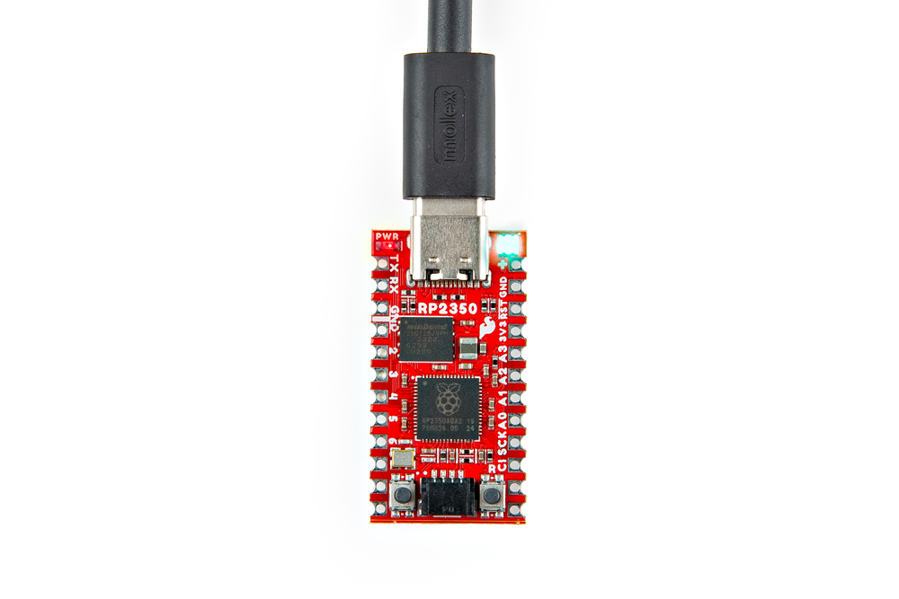
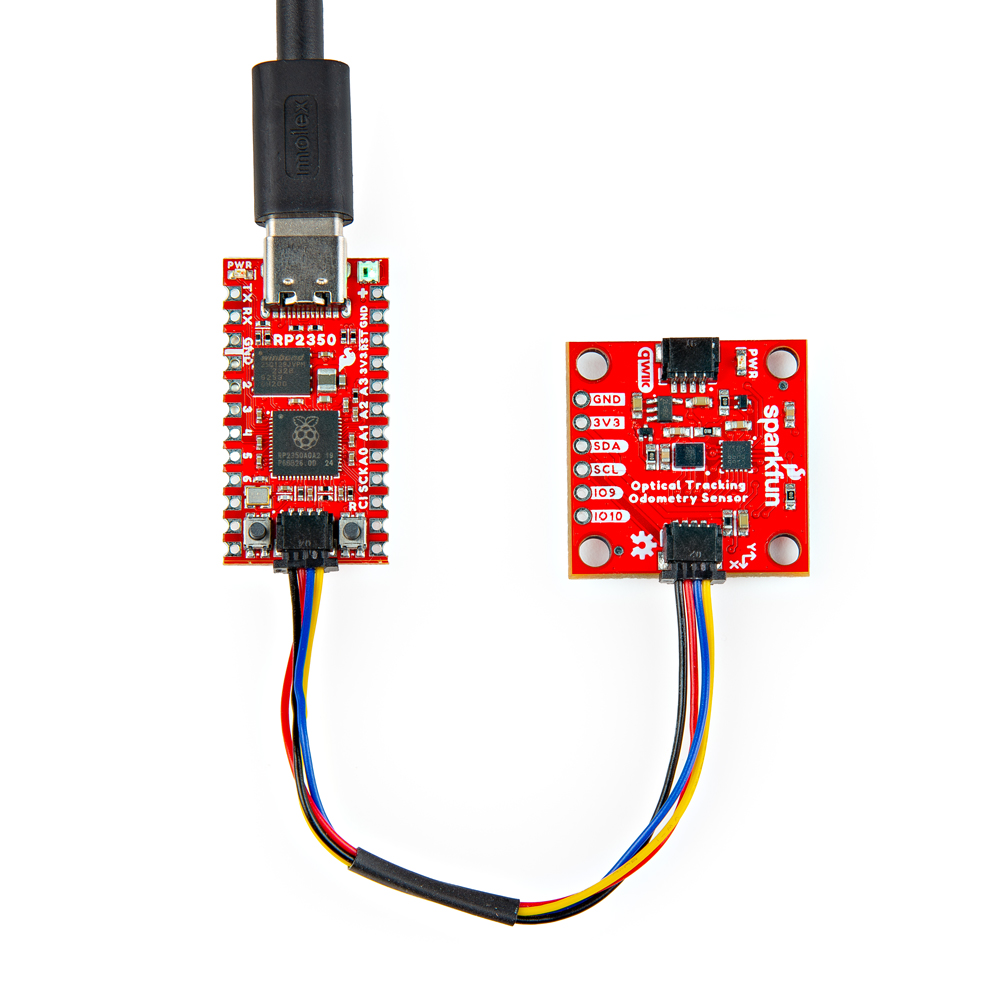
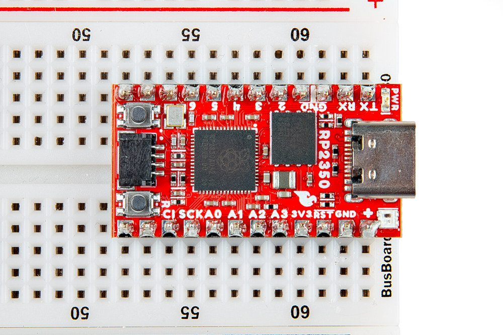
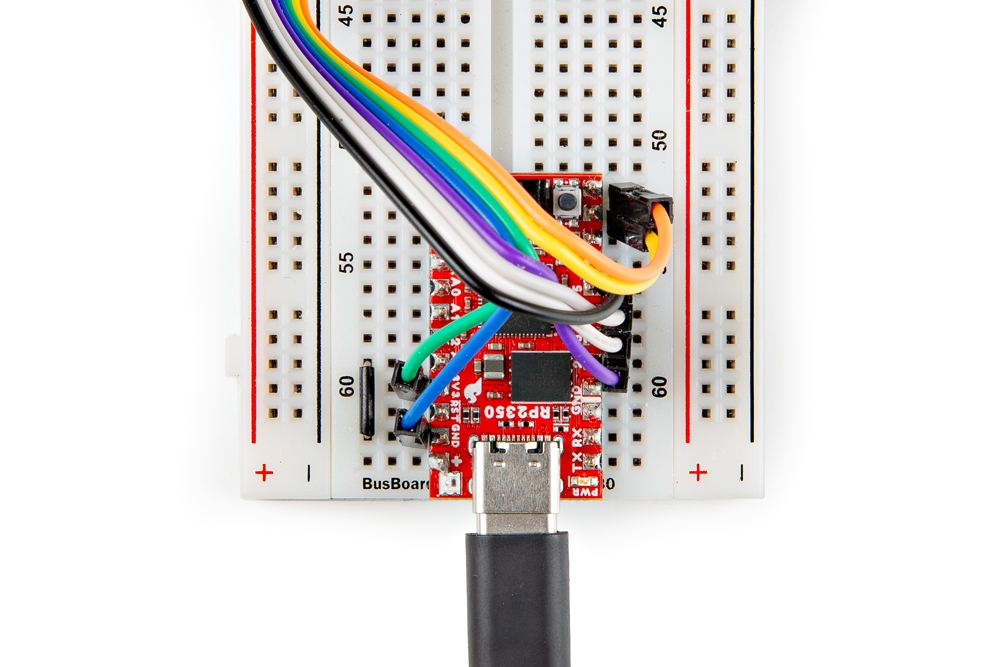

## Basic Assembly

Getting started with the Pro Micro - RP2350 is as easy as plugging it in over USB. The board ships with simple code that cycles the WS2812 RGB LED through a rainbow so on initial power up you should see that cycle.

<figure markdown>
[{ width="400"}](./assets/img/Pro_Micro_USB_Assembly.jpg "Click to enlarge")
</figure>

From here, you can quickly get started programming the board. If you'd like to quickly get started with a variety of I2C devices, SparkFun carries a variety of Qwiic boards with MicroPython support such as the [Optical Odometry Sensor]() as shown in the assembly photo below:

<figure markdown>
[{ width="400"}](./assets/img/Pro_Micro_USB_Qwiic_Assembly.jpg)
</figure>

## Camera Example Assembly

If you'd like to follow along with the Camera Example in this guide, you'll need to connect the Arducam M5 camera module to the Pro Micro over both SPI and I2C as well as connections for input voltage and ground. We recommend soldering male headers to the Pro Micro as the photo below shows and then plugging it into a breadboard for easy prototyping.

<figure markdown>
[{ width="400"}](./assets/img/Pro_Micro_Headers.jpg "Click to enlarge")
</figure>

-   <a href="https://learn.sparkfun.com/tutorials/5">
    <figure markdown>
    
    <figcaption markdown>How to Solder: Through-Hole Soldering</figcaption>
    </figure>
    </a>

??? note "New to soldering?"
	If you have never soldered before or need a quick refresher, check out our [How to Solder: Through-Hole Soldering](https://learn.sparkfun.com/tutorials/how-to-solder-through-hole-soldering) guide.
	

		<a href="https://learn.sparkfun.com/tutorials/5">
		 
        How to Solder: Through-Hole Soldering</a>
	

Next, connect the Arducam wire harness to the camera assembly if you have not already then connect it to the Pro Micro - RP2350 following the assembly table below:

<table>
    <tr>
        <th>Pro Micro - RP2350</th>
        <th>Arducam Camera</th>
    </tr>
    <tr>
        <td>5</td>
        <td>CS</td>
    </tr>
    <tr>
        <td>4</td>
        <td>MOSI/COPI</td>
    </tr>
    <tr>
        <td>3</td>
        <td>MISO/CIPO</td>
    </tr>
    <tr>
        <td>2</td>
        <td>SCK</td>
    </tr>
    <tr>
        <td>8</td>
        <td>SDA</td>
    </tr>
    <tr>
        <td>9</td>
        <td>SCL</td>
    </tr>
    <tr>
        <td>3V3</td>
        <td>VCC</td>
    </tr>
    <tr>
        <td>GND</td>
        <td>GND</td>
    </tr>
</table> 

??? note "Pull-Down Jumper"
    Not listed in the table above is the pull-down jumper between A3 and Ground. This jumper switches the example between "Standard" and "High Contrast" modes.

With the wiring completed, it should look similar to the photo below

<figure markdown>
[{ width="400"}](./assets/img/Pro_Micro_Camera_Wiring.jpg "Click to enlarge")
</figure>

