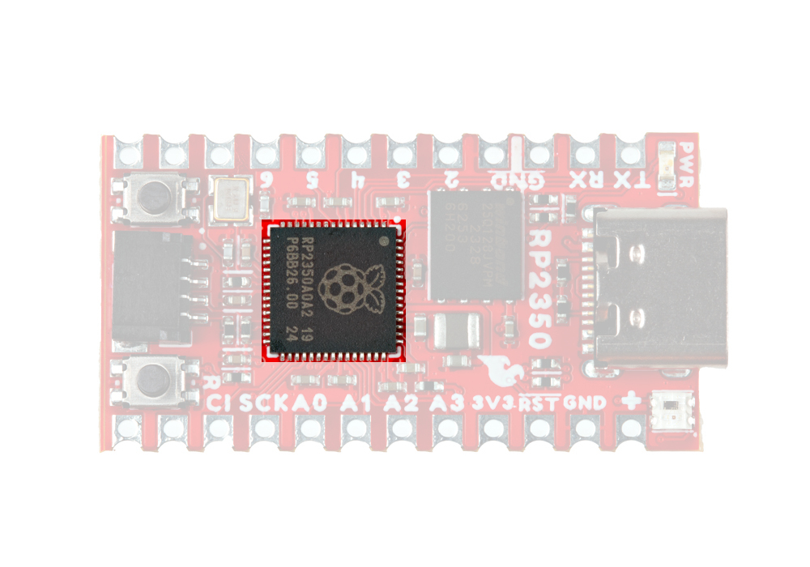
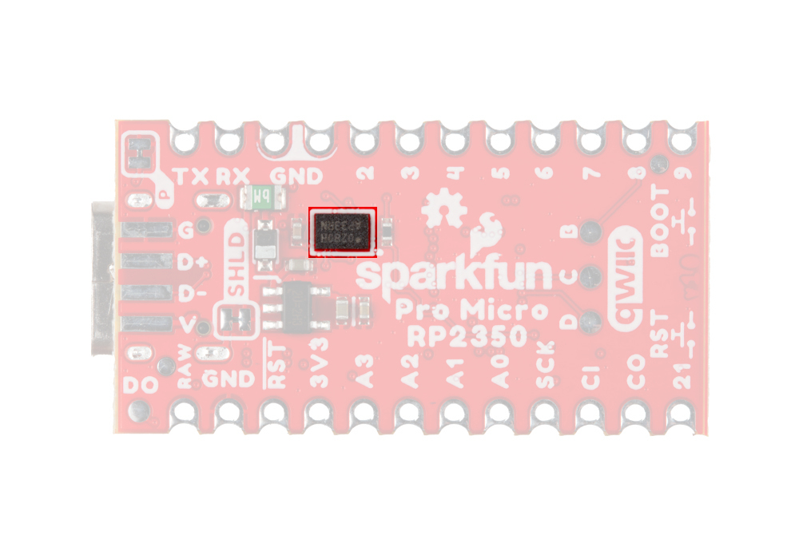
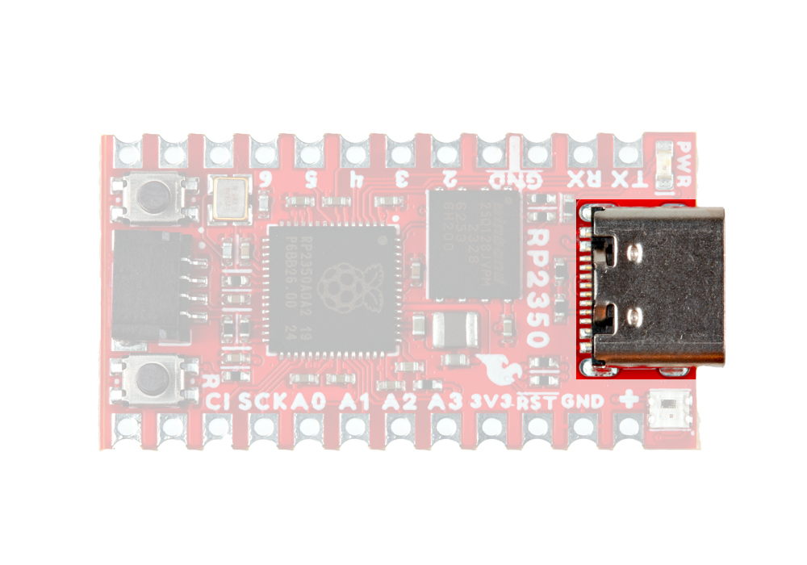
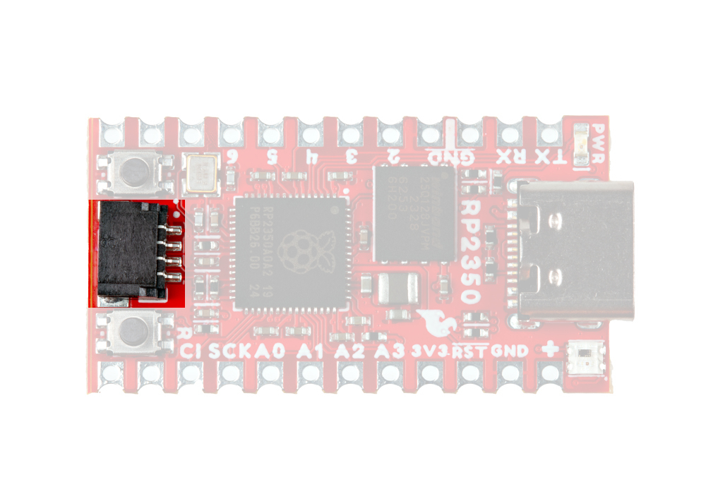
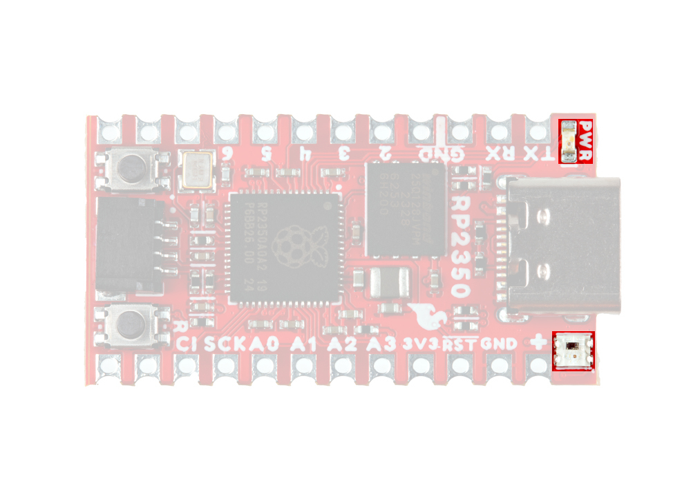
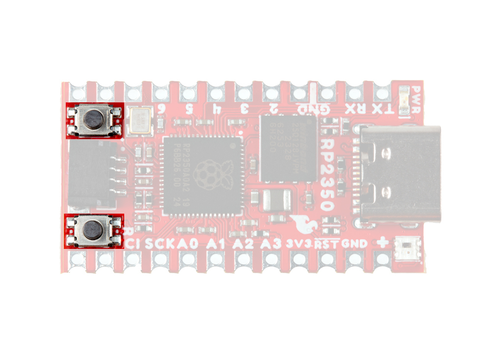
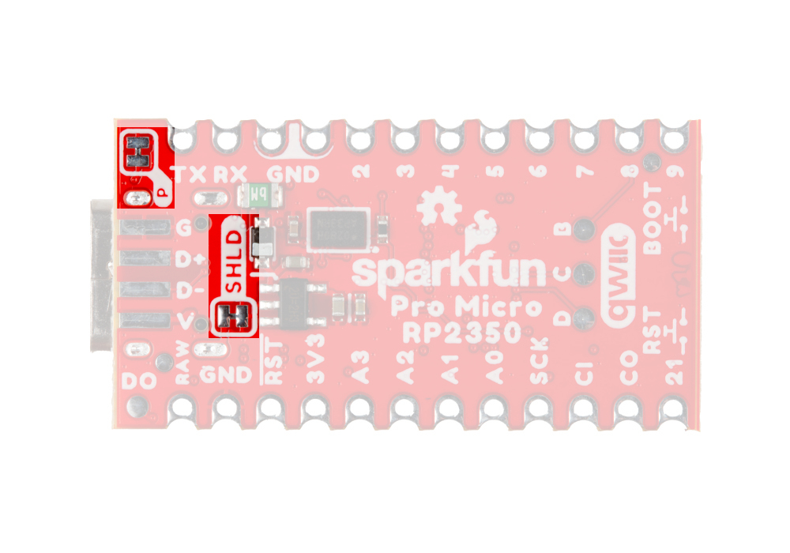

Let's take a closer look at the RP2350 and other hardware on this Pro Micro.

## Raspberry Pi RP2350

The RP2350 from Raspberry Pi packs a whole lot of computing punch in a tiny package. The RP2350 is a unique dual-core microcontroller that has <i>four</i> internal processors (two Arm Cortex-M33 and two Hazard3 RISC-V processors @150 MHz), though you can only select any two of these four to run at the same time. 

<figure markdown>
[{ width="400"}](./assets/img/Pro_Micro_RP2350-RP2350.jpg "Click to enlarge")
</figure>

This internal configuration allows users to customize the chip to their preferred architecture or to use one of each! The RP2350 includes 520kB of on-chip SRAM in ten independent banks, 8kB of one-time-programmable (OTP) storage and this board also includes PSRAM connected to the chip's QSPI bus. It also has a bevy of security features including optional boot signing with protected OTP storage for the boot decryption key, global bus filtering (based on either Arm or RISC-V security and privilege levels) and more.

The Pro Micro - RP2350 uses the "A" version of the microcontroller which has 30 5V-tolerant GPIO with 4 analog inputs and also includes the following peripheral options:

* 2x UART
* 2x SPI
* 2x I2C
* 24 PWM
* USB 1.1 Controller
* 12 PIO State Machines
* 1x High-Speed Transmit (HSTX) Peripheral for DVI/DSI support

!!! note
	Due to size constraints on the Pro Micro footprint, only 18 GPIO are broken out, including all four analog inputs.

The RP2350 accepts 

## Memory

### W25Q128 Flash

The W25Q128 Flash IC adds 16MB of storage space on the Pro Micro. This connects to the RP2350 over QSPI.

<figure markdown>
[{ width="400"}](./assets/img/ "Click to enlarge")
</figure>

### PSRAM

<figure markdown>
[{ width="400"}](./assets/img/Pro_Micro_RP2350-IC_Back.jpg "Click to enlarge")
</figure>

## Connectors & Pinout

### USB-C Connector

The USB-C connector on the board acts as the primary power and programming interface. It also has surface mount solder pads for connections to the USB data lines and USB voltage.

<figure markdown>
[{ width="400"}](./assets/img/Pro_Micro_RP2350-USB.jpg "Click to enlarge")
</figure>

### Qwiic Connector

The board includes a Qwiic connector connected to GPIO 16 (SCL) and GPIO 17 (SDA) with pull-up resistors to 3.3V.

<figure markdown>
[{ width="400"}](./assets/img/Pro_Micro_RP2350-Qwiic.jpg "Click to enlarge")
</figure>

### Pinout

This Pro Micro breaks out a total of 28 pins from the RP2350 including four analog pins, two UART interfaces, SPI, and six GPIO.

## LEDs

This Pro Micro has two LEDs; a red Power LED tied to the 3.3V line and a a WS2812 RGB LED connected to pin 25 on the RP2350.

<figure markdown>
[{ width="400"}](./assets/img/Pro_Micro_RP2350-LEDs.jpg "Click to enlarge")
</figure>

The board also has a solder pad on the bottom of the board labeled D0 users can solder to if they would like to daisy chain more WS2812 LEDs to the one on the board.

## Buttons

The board has two push-buttons connected to the RP2350's Reset and Boot lines. Holding down the BOOT button during power-up or reset bypasses Flash boot mode and forces the RP2350 into USB boot mode.

<figure markdown>
[{ width="400"}](./assets/img/Pro_Micro_RP2350-Buttons.jpg "Click to enlarge")
</figure>

## Solder Jumpers

??? note "Never modified a jumper before?"
	Check out our <a href="https://learn.sparkfun.com/tutorials/664">Jumper Pads and PCB Traces tutorial</a> for a quick introduction!
	

		<a href="https://learn.sparkfun.com/tutorials/664">
		 
        How to Work with Jumper Pads and PCB Traces</a>
	

There are two solder jumpers on the Pro Micro labeled PWR and SHLD. The PWR jumper completes the Power LED circuit and is closed by default. Open it to disable the power LED when trying to minimize the total current draw of the board. The SHLD jumper ties the USB-C connector's shield pin to the Pro Micro's ground plane and is closed by default. Open it to isolate this pin from the board's ground.

<figure markdown>
[{ width="400"}](./assets/img/Pro_Micro_RP2350-Jumpers_Back.jpg "Click to enlarge")
</figure>

## Board Dimensions

The board dimensions are illustrated in the drawing below; the listed measurements are in inches.

<figure markdown>
[{ width="400" }](../assets/img/dimensions.png "Click to enlarge")
</figure>

??? tip "Need more measurements?"
	For more information about the board's dimensions, users can download the [Eagle files](../assets/board_files/eagle_files.zip) for the board. These files can be opened in Eagle and additional measurements can be made with the dimensions tool.

	??? info ":octicons-download-16:{ .heart } Eagle - Free Download!"
		Eagle is a [CAD]("computer-aided design") program for electronics that is free to use for hobbyists and students. However, it does require an account registration to utilize the software.

		

		[Download from :autodesk-primary:{ .autodesk }](https://www.autodesk.com/products/eagle/free-download "Go to downloads page"){ .md-button .md-button--primary width="250px" }
		

	
	??? info ":straight_ruler: Dimensions Tool"
		This video from Autodesk demonstrates how to utilize the dimensions tool in Eagle, to include additional measurements:

		

		

		<iframe src="https://www.youtube.com/embed/dZLNd1FtNB8" title="EAGLE Dimension Tool" frameborder="0" allow="accelerometer; autoplay; clipboard-write; encrypted-media; gyroscope; picture-in-picture" allowfullscreen></iframe>
		

		
