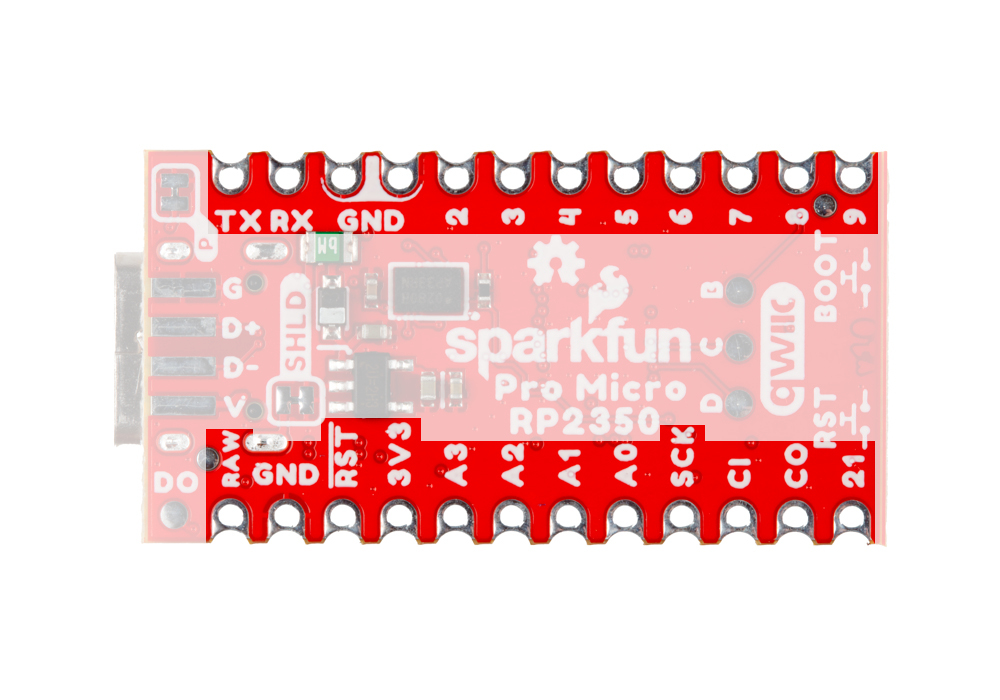
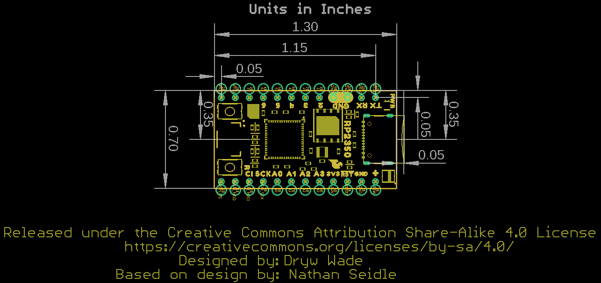

Let's take a closer look at the RP2350 and other hardware on this Pro Micro.

## Raspberry Pi RP2350

The RP2350 from Raspberry Pi packs a whole lot of computing punch in a tiny package. The RP2350 is a unique dual-core microcontroller that has <i>four</i> internal processors (two Arm Cortex-M33 and two Hazard3 RISC-V processors @150 MHz), though you can only select any two of these four to run at the same time. 

<figure markdown>
[{ width="400"}](./assets/img/Pro_Micro_RP2350-RP2350.jpg "Click to enlarge")
</figure>

This internal configuration allows users to customize the chip to their preferred architecture or to use one of each! The RP2350 includes 520kB of on-chip SRAM in ten independent banks and 8kB of one-time-programmable (OTP) storage. It also has an impressive set of security features including optional boot signing with protected OTP storage for the boot decryption key, global bus filtering (based on either Arm or RISC-V security and privilege levels) and more. For a complete overview of the RP2350, refer to the [datasheet]().

The Pro Micro - RP2350 uses the "A" version of the microcontroller which has 30 3.3V-tolerant GPIO with 4 analog inputs and also includes the following peripheral options:

* 2x UART
* 2x SPI
* 2x I2C
* 24 PWM
* USB 1.1 Controller
* 12 PIO State Machines
* 1x High-Speed Transmit (HSTX) Peripheral for DVI/DSI support

!!! note
	Due to size constraints on the Pro Micro footprint, only 18 GPIO are broken out, including all four analog inputs.

The RP2350 uses five separate power supplies though this board (and most applications) combines several of them into a single regulated 3.3V supply voltage provided either over the USB-C connector or to the RAW pin. If using the RAW pin, max input voltage is <b>5.3V</b> as RAW connects directly to the WS2812 LED. 

## Memory

### W25Q128 Flash

The W25Q128 Flash IC adds 16MB of extra programming space on the Pro Micro. This connects to the RP2350 over QSPI. 

<figure markdown>
[{ width="400"}](./assets/img/ "Click to enlarge")
</figure>

### PSRAM

The Pro Micro also includes an 8MB PSRAM IC for dynamic storage. This also connects to the RP2350 over QSPI. PSRAM support is built in to the SparkFun MicroPython fork but is not natively supported in the Pico SDK as of release. Refer to the Camera Example section of this guide for information on how to enable and set up PSRAM using the Pico SDK.

<figure markdown>
[{ width="400"}](./assets/img/Pro_Micro_RP2350-IC_Back.jpg "Click to enlarge")
</figure>

## Connectors & Pinout

### USB-C Connector

The USB-C connector on the board acts as the primary power and programming interface. It also has surface mount solder pads for connections to the USB data lines and USB voltage. The USB-C voltage is regulated down to <b>3.3V</b> which powers all components on the board. The board also has a <b>RAW</b> PTH pin to provide a dedicated supply voltage. If using this pin, the maximum voltage allowed is <b>5.3V</b> as RAW connects directly to the WS2812.

<figure markdown>
[{ width="400"}](./assets/img/Pro_Micro_RP2350-USB.jpg "Click to enlarge")
</figure>

### Qwiic Connector

The board includes a Qwiic connector connected to GPIO 16 (SCL) and GPIO 17 (SDA) with pull-up resistors to 3.3V.

<figure markdown>
[{ width="400"}](./assets/img/Pro_Micro_RP2350-Qwiic.jpg "Click to enlarge")
</figure>

### Pinout

This Pro Micro breaks out a total of 28 pins from the RP2350 including four analog pins, two UART interfaces, SPI, and six GPIO. All I/O pins are <b>3.3V</b> tolerant.

<figure markdown>
[{ width="400"}](./assets/img/Pro_Micro_RP2350-GPIO_Back.jpg "Click to enlarge")
</figure>

## LEDs

This Pro Micro has two LEDs; a red Power LED tied to the 3.3V line and a a WS2812 RGB LED connected to pin 25 on the RP2350.

<figure markdown>
[{ width="400"}](./assets/img/Pro_Micro_RP2350-LEDs.jpg "Click to enlarge")
</figure>

The board also has a solder pad on the bottom of the board labeled <b>D0</b> that users can solder to if they would like to daisy chain more WS2812 LEDs to the one on the board.

## Buttons

The board has two push buttons connected to the RP2350's Reset and Boot lines.

<figure markdown>
[{ width="400"}](./assets/img/Pro_Micro_RP2350-Buttons.jpg "Click to enlarge")
</figure>

Holding down the BOOT button during power-up or reset bypasses Flash boot mode and forces the RP2350 into USB boot mode. The buttons are labeled on the back side of the board. If you are looking at them in the orientation of the image above, the BOOT button is on top and the RESET button is on bottom.

## Solder Jumpers

??? note "Never modified a jumper before?"
	Check out our <a href="https://learn.sparkfun.com/tutorials/664">Jumper Pads and PCB Traces tutorial</a> for a quick introduction!
	

		<a href="https://learn.sparkfun.com/tutorials/664">
		 
        How to Work with Jumper Pads and PCB Traces</a>
	

There are two solder jumpers on the Pro Micro labeled PWR and SHLD.

<figure markdown>
[{ width="400"}](./assets/img/Pro_Micro_RP2350-Jumpers_Back.jpg "Click to enlarge")
</figure>

The PWR jumper completes the Power LED circuit and is closed by default. Open it to disable the power LED when trying to minimize the total current draw of the board. The SHLD jumper ties the USB-C connector's shield pin to the Pro Micro's ground plane and is closed by default. Open it to isolate this pin from the board's ground.

## Board Dimensions

This board matches the Pro Micro footprint and measures 1.3in x 0.7in (33.02mm x 17.78mm).

<figure markdown>
[{ width="400" }](./assets/board_files/SparkFun_ProMicro_RP2350-Dimensions.png "Click to enlarge")
</figure>

??? tip "Need more measurements?"
	For more information about the board's dimensions, users can download the [Eagle files](../assets/board_files/eagle_files.zip) for the board. These files can be opened in Eagle and additional measurements can be made with the dimensions tool.

	??? info ":octicons-download-16:{ .heart } Eagle - Free Download!"
		Eagle is a [CAD]("computer-aided design") program for electronics that is free to use for hobbyists and students. However, it does require an account registration to utilize the software.

		

		[Download from :autodesk-primary:{ .autodesk }](https://www.autodesk.com/products/eagle/free-download "Go to downloads page"){ .md-button .md-button--primary width="250px" }
		

	
	??? info ":straight_ruler: Dimensions Tool"
		This video from Autodesk demonstrates how to utilize the dimensions tool in Eagle, to include additional measurements:

		

		

		<iframe src="https://www.youtube.com/embed/dZLNd1FtNB8" title="EAGLE Dimension Tool" frameborder="0" allow="accelerometer; autoplay; clipboard-write; encrypted-media; gyroscope; picture-in-picture" allowfullscreen></iframe>
		

		
