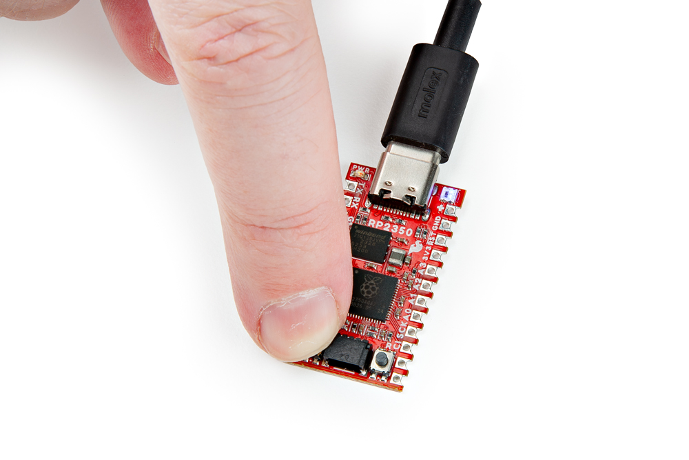

The Pro Micro - RP2350 uses a UF2 bootloader for easy flashing/uploading of code to the board. The UF2 bootloader causes the board to show up on your computer as a USB storage device and does <b>not</b> require any drivers for Windows, Mac OSX, and Linux! This bootloader is used for uploading in both the Pico SDK and MicroPython development environments so let's take a brief look at how to enter bootload mode.

## What is UF2?

UF2 stands for USB Flashing Format, which was developed by Microsoft for PXT (now known as MakeCode) for flashing microcontrollers over the Mass Storage Class (MSC), just like a removable flash drive. The file format is unique, so unfortunately, you cannot simply drag and drop a compiled binary or hex file onto the board. Instead, the format of the file has extra information to tell the processor where the data goes, in addition to the data itself. For more information about UF2, you can read more from the [MakeCode blog](https://makecode.com/blog/one-chip-to-flash-them-all), as well as the [UF2 file format specification](https://github.com/Microsoft/uf2).

## Entering the Bootloader

Putting the Pro Micro - RP2350 only requires a couple of presses of the BOOT and RESET buttons. Start by pressing and holding the BOOT button down:

<figure markdown>
[{ width="400"}](./assets/img/Boot1.jpg "Click to enlarge")
</figure>

Next, press and release the RESET button while still holding down the BOOT button:

<figure markdown>
[{ width="400"}](./assets/img/Boot2.jpg "Click to enlarge")
</figure>

Finally, release the BOOT button and the board should be in bootloader mode and appear on your computer as a USB storage device called "RP2350".